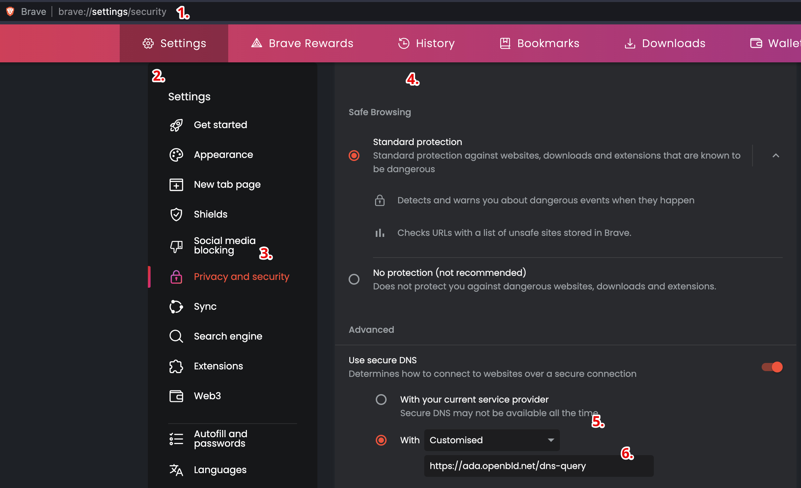

# Brave Browser

Brave браузерінде OpenBLD.net баптау

1. Браузер терезесінде мәзір батырмасын басыңыз.
2. «Баптауларға» өтіңіз.
3. Сол жақтағы мәзірде Құпиялылық және қауіпсіздікті таңдаңыз.
4. Құпиялылық және қауіпсіздік > Қауіпсіздікті таңдаңыз.
5. Ашылатын мәзірден «Қауіпсіз DNS пайдалану» бөлімінде «Баптауды» таңдаңыз.
6. Мекенжайды көрсетіңіз: `https://ada.openbld.net/dns-query`

## Мысал



Жәй ғана көшіріп алып, осы сілтемені өз браузеріңіздің баптауына қойыңыз:

```shell
https://ada.openbld.net/dns-query
```

## OpenBLD.net Brave Extension

Қосымша опция ретінде сіз Brave Browser браузерлік кеңейтуді пайдалана аласыз:

* Brave браузері үшін [OpenBLD.net Blocker](/docs/get-started/setup-browsers/extensions/) кеңейтуді орнатыңыз.
