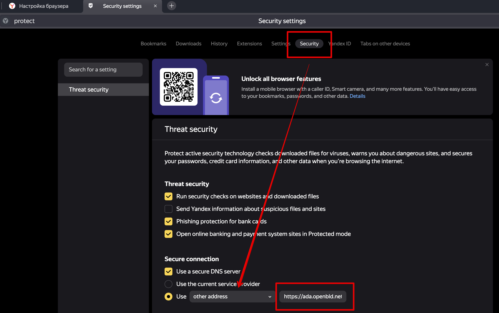

# Яндекс Браузер

Яндекс браузерде жарнама мен бақылауды бұғаттау үшін қауіпсіз DNS-серверді баптау қажет.

Браузерде OpenBLD.net баптау

1. Браузер терезесінің оң жақ жоғары бұрышындағы мәзір белгішесін шертіп басыңыз (Баптаулар мәзірі)
2. Баптауларды таңдаңыз
3. Қауіпсіздік бөлімін таңдаңыз
4. Төмен қарай айналдырыңыз және қауіпсіз DNS пайдалануды қосыңыз
5. Ашылатын мәзірде "Басқа мекенжайды" таңдаңыз
6. Мекенжайды көрсетіңіз `https://ada.openbld.net/dns-query`

## Мысал


Жәй ғана көшіріп алып, осы сілтемені өз браузеріңіздің баптауына қойыңыз:

```shell
https://ada.openbld.net/dns-query
```

## Яндекс Браузер үшін OpenBLD.net кеңейту

Қосымша опция ретінде сіз Яндекс Браузер үшін кеңейтуді пайдалана аласыз:

* Яндекс Браузер үшін кеңейтуді [OpenBLD.net Blocker](/docs/get-started/setup-browsers/extensions/) баптау.
