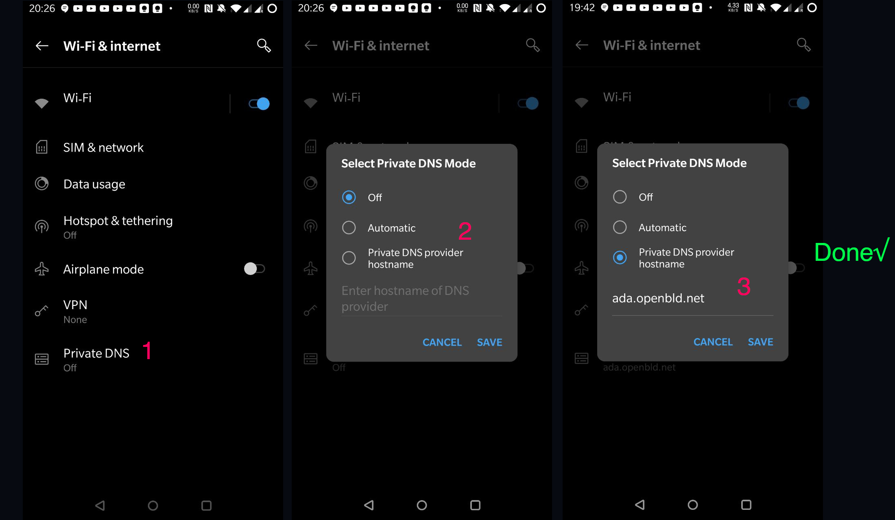

# Android Құрылғылар 

Андроид (Android) құралдарында жарнаманы және бақылауды бұғаттау үшін DNS Жеке серверін баптау қажет.

OpenBLD.net-ті Android құрылғыларында баптау

1. «Баптауларды» ашыңыз. Іздестіру баптауларында DNS енгізіңіз. Іздестіру нәтижелерінде Жеке DNS тауып алыңыз
2. Жеке DNS баптауларын ашыңыз және «DNS провайдері хостының жеке атауын» таңдаңыз.
3. `ada.openbld.net` қосыңыз және сақтаңыз.

## Мысал



Жәй ғана көшіріп алып, осы мекенжайды DNS баптауларында қойыңыз:

```shell
ada.openbld.net
```

Отбасылық режим:

```shell
kid.openbld.net
```
