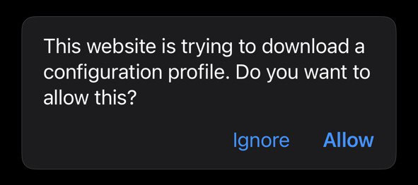
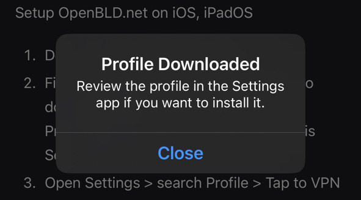
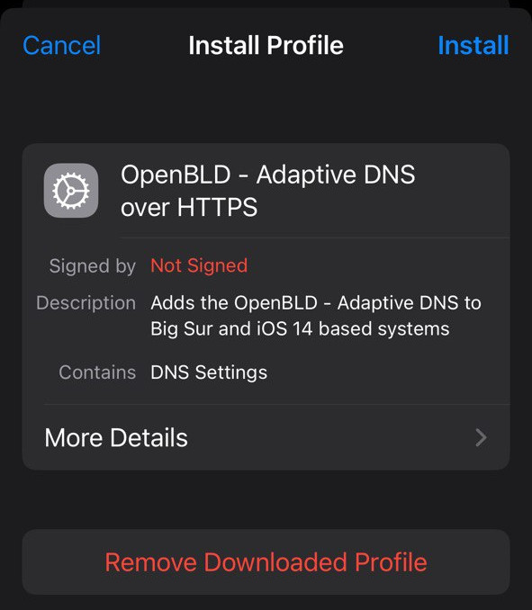
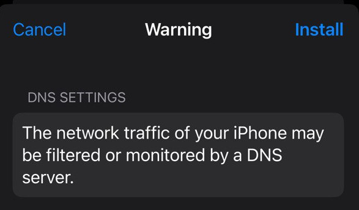

# Apple Құрылғылар

Apple құралдарында жарнаманы және бақылауды бұғаттау үшін DNS профильді баптау қажет.

iOS, iPadOS және macOS-та OpenBLD.net баптау

1. `Safari` ашыңыз және ADA iOS/macOS [профиль](pathname:///profiles/OpenBLD-DoH-v15-3.mobileconfig)

2. Профильді жүктеп алғаннан кейін сіз мынадай хабарламаны көресіз:
_**Профиль көшірілді. Егер оны орнатуды қалайтын болсаңыз, профильді «Баптаулар» қосымшасында тексеріңіз.**_:

:::note

Кейбір жағдайларда профиль `xml` форматындағы **мәтіндік** файл ретінде болуы мүмкін:

Уайымдамаңыз, жәй ғана оны **жүктеп алыңыз**:

содан кейін _Файлдар_ немесе папкалар _Жүктеулер_ қосымшасынан **ашыңыз**.

:::

3. «Баптауларды» ашыңыз > **Профиль жүктелді** баптаулардың жаңа элементін табыңыз.

4. Профильді **орнату**:

5. DNS баптауларын **орнату**:

6. Дайын!

:::tip
### RIC Профиль
Егер сіз RIC пайдалануды қалайтын болсаңыз, сіз [профиль RIC](pathname:///profiles/OpenBLD-RIC-DoH-v15-3.mobileconfig) жүктеп алуыңыз және оны ADA профиль секілді орнатуыңыз қажет.
:::
