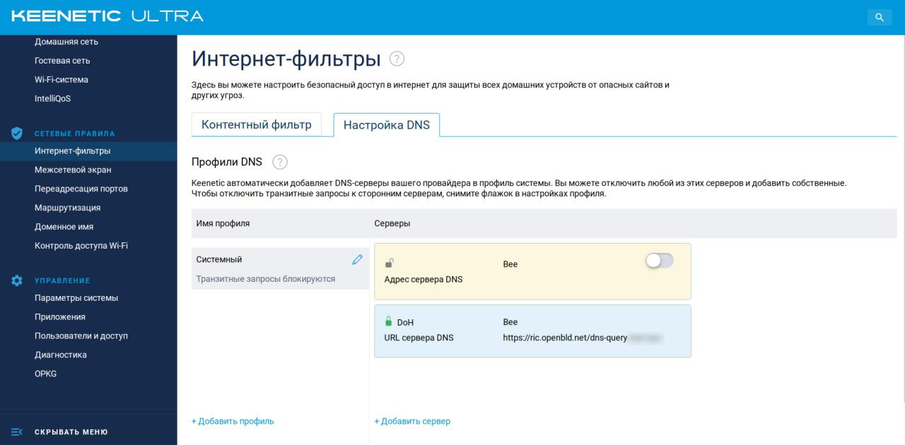
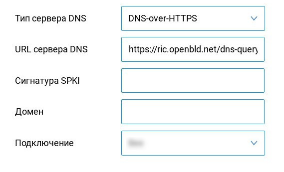
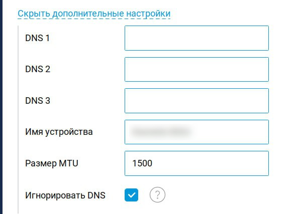

# Желілік құрылғылар

Егер сіздің маршрутизаторыңыз DoH/DoT қолданатын болса, сіз OpenBLD.net-ті `dns-query` сілтемесімен `https` ретінде пайдалана аласыз:

```shell
https://ada.openbld.net/dns-query
```

Немесе `tls`:

```shell
ada.openbld.net
```

## Құрылғыларға арналған нұсқаулықтар

### Keenetic

ADA немесе RIC-ті өзіңіздің Keenetic маршрутизаторыңызда DoH/DoT DNS-провайдер ретінде пайдаланыңыз:



DoH пайдалану кезінде:



Қосымша баптаулар терезесінде "DNS елемеу" жалаушасын орнатуды ұмытпаңыз:



* Keenetic қалай [баптау керек](https://help.keenetic.com/hc/ru/articles/360007687159-%D0%9F%D1%80%D0%BE%D0%BA%D1%81%D0%B8-%D1%81%D0%B5%D1%80%D0%B2%D0%B5%D1%80%D1%8B-DNS-over-TLS-%D0%B8-DNS-over-HTTPS-%D0%B4%D0%BB%D1%8F-%D1%88%D0%B8%D1%84%D1%80%D0%BE%D0%B2%D0%B0%D0%BD%D0%B8%D1%8F-DNS-%D0%B7%D0%B0%D0%BF%D1%80%D0%BE%D1%81%D0%BE%D0%B2)
  * Keenetic-те DoT және DoH баптау жөніндегі ресми [нұсқаулық](https://support.keenetic.ru/eaeu/ultra/kn-1811/en/31543-dot-and-doh-proxy-servers-for-dns-requests-encryption.html) 
  * Тағы бір нәрсе [нұсқаулық](https://help.keenetic.com/hc/ru/articles/360007687159-%D0%9F%D1%80%D0%BE%D0%BA%D1%81%D0%B8-%D1%81%D0%B5%D1%80%D0%B2%D0%B5%D1%80%D1%8B-DNS-over-TLS-%D0%B8-DNS-over-HTTPS-%D0%B4%D0%BB%D1%8F-%D1%88%D0%B8%D1%84%D1%80%D0%BE%D0%B2%D0%B0%D0%BD%D0%B8%D1%8F-DNS-%D0%B7%D0%B0%D0%BF%D1%80%D0%BE%D1%81%D0%BE%D0%B2) 

### Mikrotik

:::warning
OpenBLD.net **HTTP/2** хаттамасын пайдаланады. Mikrotik HTTP/2 қолдамайды және  DoH клиенті ретінде пайдаланыла алмайды.
:::

* Mikrotik қалай [баптау керек](https://jcutrer.com/howto/networking/mikrotik/mikrotik-dns-over-https)
  * Бұл мақалада 2 қадамда жұмыс істемейтін сілтеме көрсетілген, түзетілуі мүмкін:
  * `/tool fetch url=https://curl.se/ca/cacert.pem`
  * `/certificate import file-name=cacert.pem passphrase="your password"`
