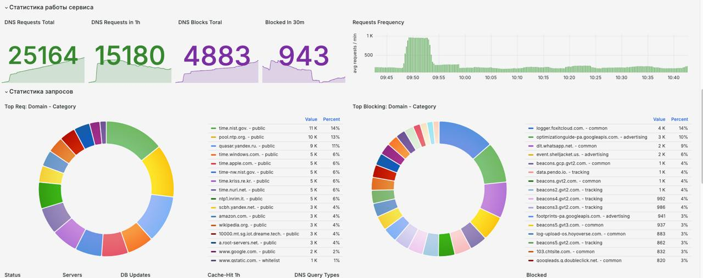

# OpenBLD.net компоненттері дегеніміз не?

OpenBLD.net Gears – бұл өнімділікті, қауіпсіздікті және құпиялылықты жақсарту үшін OpenBLD.net ұсынатын технологиялар мен сервистердің жинағы.

## Компоненттер

### Басқару жүйесі

- **Private DNS Profiling (PDP)**: DNS-сұрау салуларды оқшаулауды, DNS дербестендірілген баптауларды, DNSSEC, TLSv1.2 және TLSv1.3-пен қорғауды қамтамасыз ететін сервис.
- **DNS Upstream Fly Selector (DUFS)**: Таңдалған теңдестіру режиміне байланысты жоғары тұрған қолжетімді жылдам серверлерге автоматты түрде ауысатын сервис.
- **DNS Guarantee Resolving System (DGRS)**: Егер жоғары тұрған DNS-серверлер рұқсат етпеген болса, DNS-сұрау салуларға рұқсат беруге кепілдік беретін жүйе.

### Аспаптар панелі

- **Custom Terminal Messages (CTM)**: `nslookup` және т.б. үшін терминал хабарламасын баптауға мүмкіндік береді.
- **Dashboard System (DS)**: Метрикалар деректерімен аспаптар панелін ұсынатын жүйе.
- **Metrics Collection (MC)**: DNS-сұрау салулар мен жауаптар туралы мертикаларды жинайтын сервис.

### Тежегіш жүйе

- **DNS Type Blocking (DTB)**: DNS-сұрау салулардың белгілі бір түрлерін бұғаттайтын сервис.
- **DNS Filtering (DF)**: Тізімдер негізінде DNS-сұрау салуларды сүзгілейтін сервис.
- **Blocklists with Categories (BLC)**: Санаттар негізінде қажетсіз контентті бұғаттайтын сервис.
- **DNS Rate Limiting (DRL)**: Уақыт терезесінде DNS-сұрау салулардың санын шектейтін сервис.

### Нитро

- **DNS Race Resolver (DRR)**: Бірнеше жоғары тұрған серверлерде DNS-сұрау салуларға рұқсат беретін және ең жылдам жауапты қайтаратын сервис.
- **DNS Transmission Switching (ADDS)**: Басымдықты (сенім білдірілген) домендік атаулар үшін DNS барынша жылдам жоғары тұрған серверлерге сараланған ауыстырғыш.
- **DNS Caching (DC)**: Рұқсат беру процесін жылдамдату үшін DNS-сұрау салуларды кештейтін сервис.

### Датчиктер

- **DNS Logging (DL)**: DNS-сұрау салулар мен жауаптарды логтарда тіркейтін сервис. Логтарды ротациялау механизмі бар.
- **Multi Output Channeling (MOC)**: Әртүрлі шығу деректеріне (логтар, терминал) арналған әртүрлі каналдар.
- **DNS Rsyslog forwarding (RSF)**: Қашықтағы syslog-серверге логтарды жіберетін сервис.
- **EDNS Client Subnet Detector (ECSD)**: Клиенттің қосалқы желісі туралы ақпарат беретін сервис.

## Режимдер

OpenBLD.net Gears сіздің Интернеттегі жұмысыңызды реттеуге көмектесетін және мыналарда әдепкі қалпы бойынша баптаулар ретінде қолжетімді бірнеше режимдерді ұсынады:
- 
- **ADA - Adaptive DNS Acceleration**: Басымдықты (сенім білдірілген) домендің атаулар үшін барынша жылдам жоғары тұрған серверлерге автоматты түрде ауыстыру режимі.
- **RIC - Strict DNS Concentration**: PDP Gear-ден OpenBLD.net серверлеріне көптеген DNS-сұрау салуларға рұқсат беретін режим. Барлық қалған DNS-сұрау салулар бұғатталады.
- **KID - Kid Protection Mode**: Ересектерге арналған контентті, құмар ойындарын және басқа қажетсіз контентті бұғаттайтын режим.
- **ZTM - Zero Trust Mode**: Пайдаланушы анық рұқсат бергендерінен басқа барлық 
DNS-сұрау салуларды бұғаттайтын режим.

## Дашбордтар

Prometheus және Grafana сәйкес келетін метрикалардың барлық деректері.

## Рейт Лимитинг

Бір секундтағы DNS-сұрау салулардың санын шектейтін және пайдаланушының қалауы бойынша баптауға болатын қызмет.

Параметрлері:

- **Per IP Address**: IP-мекенжайға DNS-сұрау салулар санын шектейді.
- **Per Byte**: Байттар санына DNS-сұрау салулар санын шектейді.
- **Per NXDOMAIN**: NXDOMAIN-ға DNS-сұрау салулар санын шектейді.
- **Block by Query Type**: Сұрау салу түріне DNS-сұрау салулар санын шектейді.
- **Blocking Threshold**: Егер бір секундтағы DNS-сұрау салулар саны белгілі бір шектен асатын болса, IP-мекенжайды бұғаттайды.
- **Blocking Time**: Егер бір секундтағы DNS-сұрау салулар саны белгілі бір шектен асатын болса, IP-мекенжайды бұғаттау уақыты.
- **Whitelist**: Белгілі бір IP-мекенжайлар мен CIDR жылдамдықты шектеуден айналып өтуге мүмкіндік береді.

## Сүзгілеу

- Жергілікті және қашықтағы файлдарды жүктеу
- Тұрақты айтулар
- Домендер тізімдері
- Блоклистерді жүктеудің реттелетін аралығы

## Кэштеу

- DNS жауаптарын кэштеу
- Әртүрлі жауап түрлеріне арналған кэштеудің әртүрлі стратегиялары
- Санаттармен молайтылған жауаптарды кэштеу
- Кешті автоматты түрде тазарту
- Жауаптар матчингін кэштеу

## Логтау

- Бейсинхронды логтау
- Қашықтағы syslog-серверге логтарды форвардтау
- Бұғатталған домендерді қосымша ақпаратпен (санаттармен) молайту
- Түрлі-түсті логтар

## Режимдер

- Zero Trust Mode (ZTM): Пайдаланушы айқын рұқсат бергендерден басқа барлық 
DNS-сұрау салуларды бұғаттайтын режим.
- Blackhole Mode (BHM): Бұғаттау парақтарының негізінде DNS-сұрау салуларды бұғаттайтын режим.

:::tip
Пайдаланушы белгілі бір режимді өз қалауы бойынша қоса алады.
:::

## Қосымша ақпарат

:::important
* Бұл пайдаланушыларға [OpenBLD Plus](/docs/overwiew/openbld-plus/) режиміндегі қызмет ретінде ұсынылатын OpenBLD.net өзінің ішкі технологиялары мен сервистері.
* Технологиялардың барлығы жария пайдалану үшін қолжетімді емес.
* Бұл технологиялар жария сервистерде **пайдаланылмайды**:
  * метрикалар жоқ
  * логтар жоқ (_Бұл қалай жұмыс істейді_ қараңыз)
  * деректерді жинау жоқ
  * деректерді сату жоқ
  * аналитика жоқ
  * деректердің орталық қоймасы жоқ
  * деректер агрегациясы жоқ
  * қосымша ақпарат алу үшін [How it works](/docs/overwiew/how-it-works/) қараңыз.
:::
