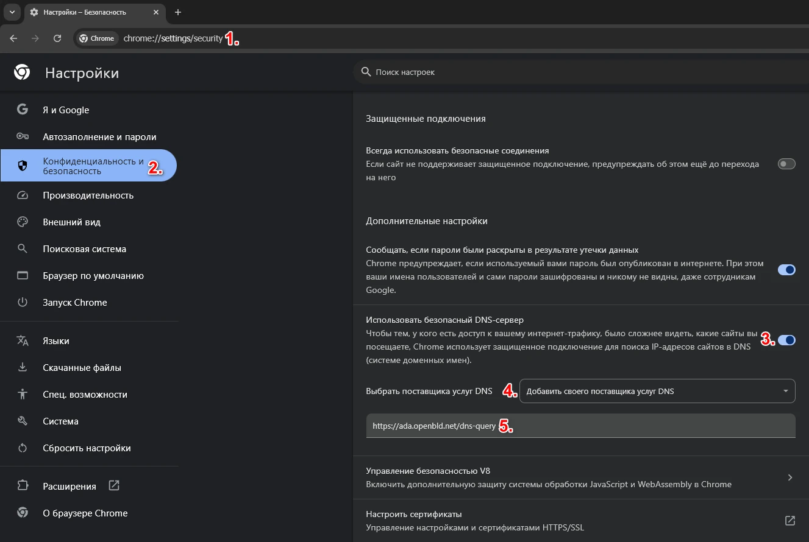

# Google Chrome

Для блокировки рекламы и отслеживания в браузере Google Chrome, нужно настроить безопасный DNS over HTTPS.

Настройка OpenBLD.net в Google Chrome

1. Кликнуть меню из трех точек в окне браузера (Меню Настроек) > Настройки
2. Выбрать **Конфиденциальность и Безопасность**
3. Прокрутить ниже и включить использование безопасного DNS
4. Выбрать в выпадающем меню **Добавить своего поставщика услуг DNS**
5. Указать адрес:

```shell
https://ada.openbld.net/dns-query
```

## Семейный режим:

```shell
https://kid.openbld.net/dns-query
```

## Пример



## Расширение OpenBLD.net для Google Chrome

В качестве дополнительной опции можно использовать расширение для браузера Google Chrome:

* Установите расширение [OpenBLD.net Blocker](/docs/get-started/setup-browsers/extensions/) для Google Chrome и браузера Brave.


