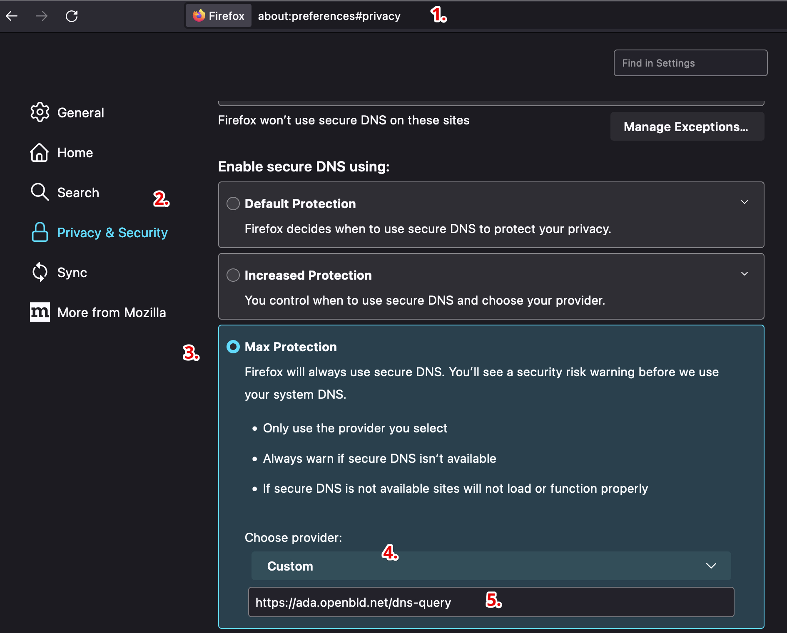

# Mozilla Firefox

Настройка OpenBLD.net в Mozilla Firefox

1. Нажмите кнопку меню и выберите «Настройки».
2. В меню левой панели выберите Конфиденциальность и безопасность.
3. Прокрутите вниз до пункта Включить безопасный DNS > Максимальная защита.
4. Выберите поставщика > Пользовательский.
5. Укажите адрес: `https://ada.openbld.net/dns-query`

## Example



Просто скопируйте и вставьте эту ссылку в настройки вашего браузера:

```shell
https://ada.openbld.net/dns-query
```


