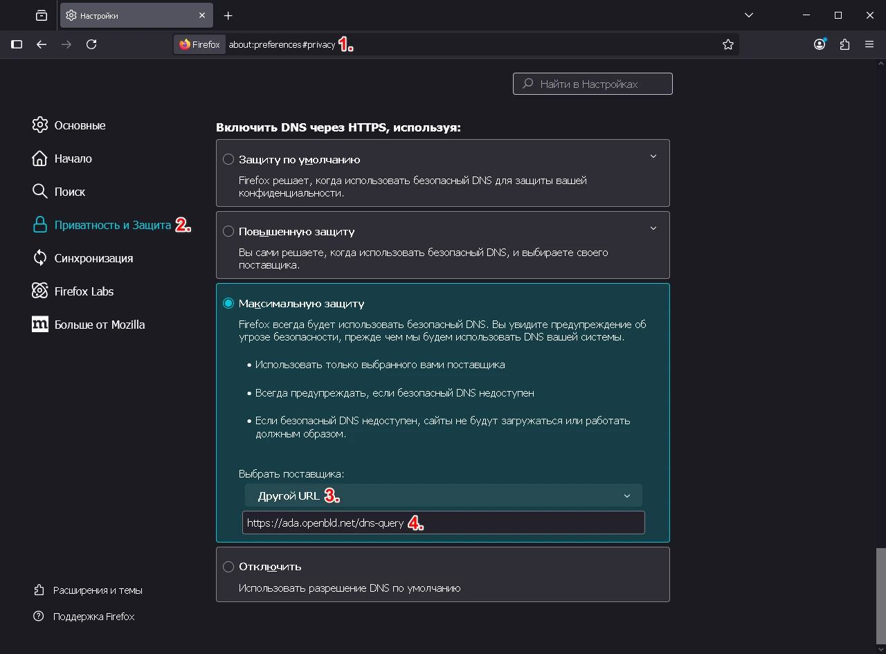

# Mozilla Firefox

Настройка OpenBLD.net в Mozilla Firefox

1. Нажмите кнопку меню и выберите **Настройки**
2. В меню левой панели выберите **Конфиденциальность и Защита**
3. **Включить DNS через HTTPS** > **Максимальная защита** > Выберать поставщика > **Другой URL**
5. Указать адрес:

```shell
https://ada.openbld.net/dns-query
```

## Пример




