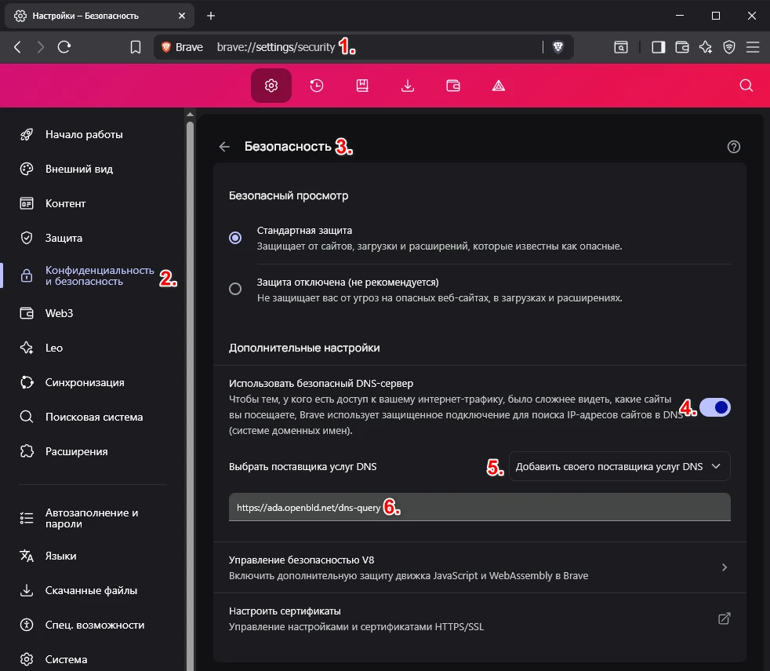

# Brave Browser

Настройка OpenBLD.net в браузере Brave

1. Перейдите в **Настройки**
2. В меню слева выбрать **Конфиденциальность и безопасность**
3. Перейти в раздел параметров **Безопасность**
4. Включить опцию **Использовать безопасный DNS**
5. В выпадающем списке выбрать **Добавить своего поставщика услуг DNS**
6. Указать адрес:

```shell
https://ada.openbld.net/dns-query
```

## Пример



## OpenBLD.net раширение для Brave 

В качестве дополнительной опции можно использовать расширение для браузера:

* Установить расширение [OpenBLD.net Blocker](/docs/get-started/setup-browsers/extensions/) для браузера Brave.
