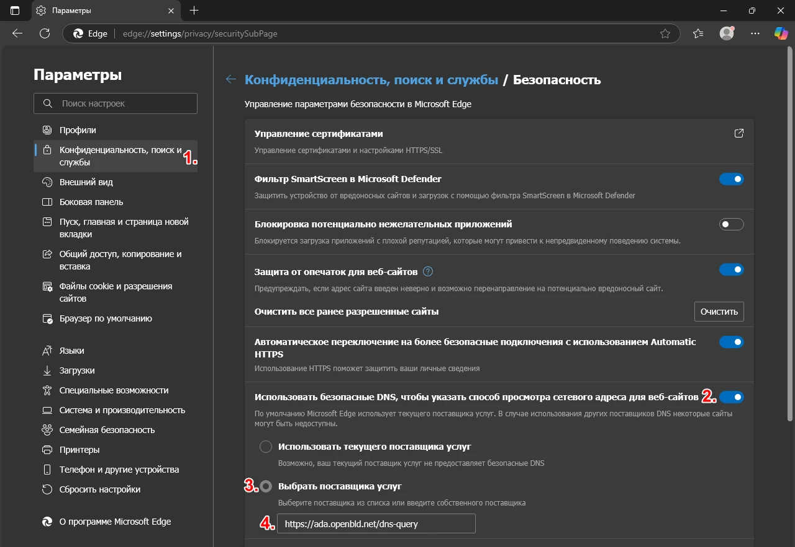

# Microsoft Edge

Настройка OpenBLD.net в Microsoft Edge

1. Перейдите в `edge://settings/privacy`, раздел «Конфиденциальность, поиск и службы»
2. Убедитесь, что опция «Использовать безопасный DNS» включена.
3. Выберите «Выбрать поставщика услуг»
4. Укажите адрес:

```shell
https://ada.openbld.net/dns-query
```

## Пример:


