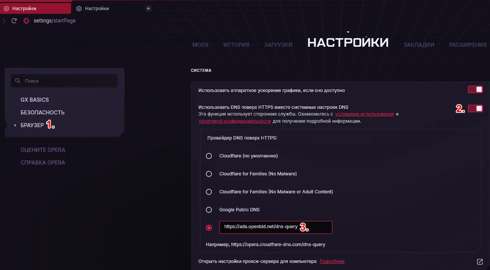

# Opera GX

Настройка OpenBLD.net в Opera GX:

1. Settings > Browser
2. Scroll down to the SYSTEM section
3. Enable `Use DNS-over-HTTPS instead of the system DNS settings`
4. Select custom DNS provider option:
5. Add address:

```shell
https://ada.openbld.net/dns-query
```

Example:



