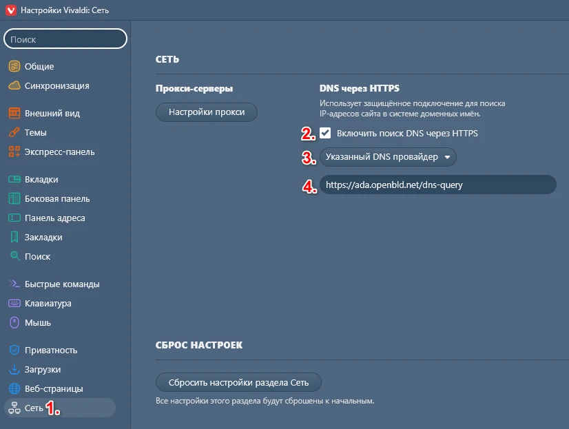
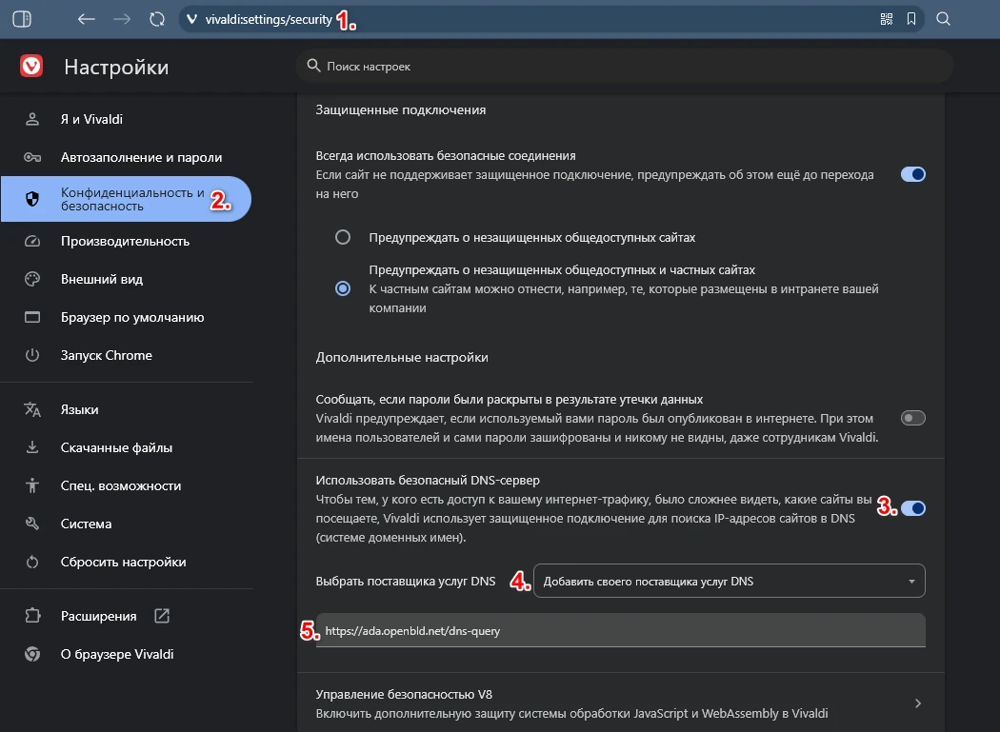

# Vivaldi Browser

Для блокировки рекламы и отслеживания в браузере Vivaldi необходимо настроить безопасный DNS-сервер через настройки `Сеть`:

1. Настройки > Сеть
2. В параметрах DNS через HTTPS (DoH) > **Включить поиск DNS через HTTPS**
3. Выбрать **Указанный DNS провайдер**
4. Указать адрес:

```shell
https://ada.openbld.net/dns-query
```

## Пример




## Метод 2: Настройка OpenBLD.net в Vivaldi Браущере

1. В адресной строке набрать `chrome://settings/security` (произойдет редирект к `vivaldi://settings/security`)
2. Выбрать раздел **Конфиденциальность и безопасность**
3. Включить **Использовать безопасный DNS-сервер**
4. Выбрать "Добавить своего постащика услуг DNS"
5. Указать адрес:

```shell
https://ada.openbld.net/dns-query
```

## Пример



## OpenBLD.net Extension for Vivaldi Browser

Как дополнительная опция можно использовать расширение для Vivaldi Браузера:

* Setup [OpenBLD.net Blocker](/docs/get-started/setup-browsers/extensions/) extension.


