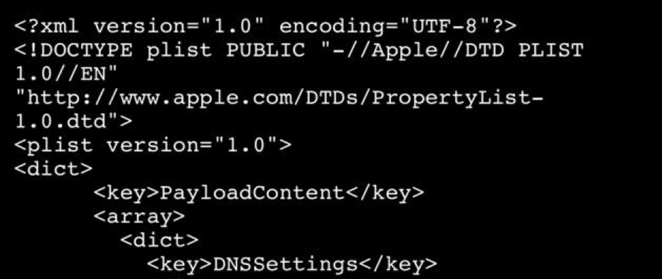
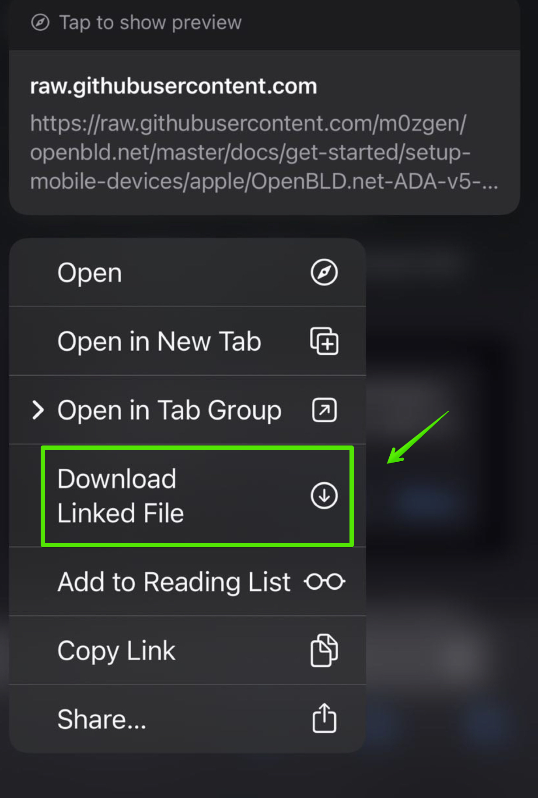
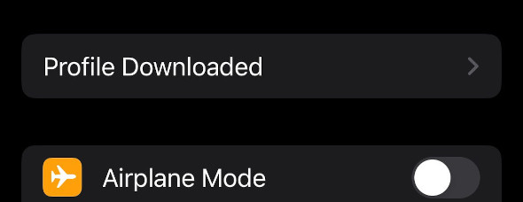

# Apple Устройства

Для блокировки рекламы и отслеживания на устройствах Apple, нужно установить DNS профиль.

Настройка OpenBLD.net на iOS, iPadOS и macOS

1. Откройте `Safari` и **Разрешите** скачать ADA iOS/macOS [профиль](https://raw.githubusercontent.com/m0zgen/openbld.net/master/docs/get-started/setup-mobile-devices/apple/OpenBLD.net-ADA-v5-21.mobileconfig)

:::note

В некоторых случаях профиль может быть открыт как **текстовый** файл в формате `xml`:

Не волнуйтесь, просто **скачайте** его:

- Нажмите на ссылку загрузки профиля
- Удерживайте палец на экране, чтобы отобразить контекстное меню
- Выберите **Загрузить**:

и затем **откройте** из приложения _Файлы_ или папки _Загрузки_.

:::

2. После загрузки профиля вы увидите сообщение: 
_**Профиль скачан. Проверьте профиль в приложении «Настройки», если хотите его установить.**_:

3. Откройте «Настройки» > найдите новый элемент настроек **Профиль загружен**.

4. **Установить** профиль:

5. **Установить** Настройки DNS:

6. Готово!

:::tip
### RIC Профиль
Если вы хотите использовать RIC, вам нужно скачать [профиль RIC](https://raw.githubusercontent.com/m0zgen/openbld.net/master/docs/get-started/setup-mobile-devices/apple/OpenBLD.net-RIC-v24-2.mobileconfig) и установить его так же, как и ADA профиль.
:::
