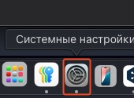
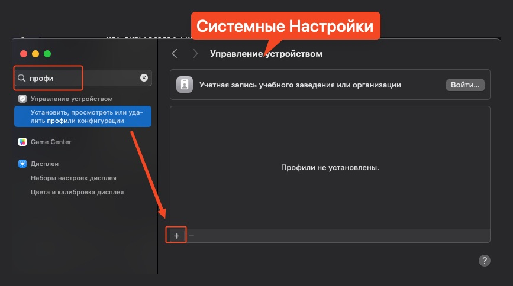
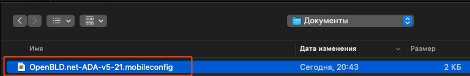
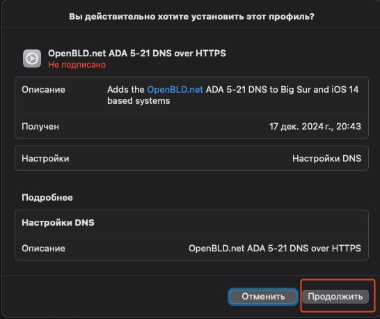
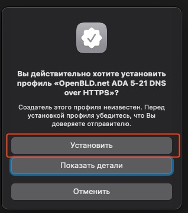

# MacOS

Настройка OpenBLD.net в macOS:

1. Откройте Safari
2. Загрузите профиль со страницы настроек [Apple устройств](/docs/get-started/setup-mobile-devices/apple)
3. Установите профиль по аналогии с [настройкой iOS](/docs/get-started/setup-mobile-devices/apple)

## Пошаговая инструкция

После загрузки профиля, вы можете установить его, следуя этим шагам:

1. Откройте Системные настройки

2. Найдите раздел Профили в разделе Управление устройством и нажмите кнопку Добавить `+`

3. Выберите загруженный профиль OpenBLD.net и нажмите кнопку Открыть:

4. Нажмите кнопку **Продолжить**:

5. Нажмите кнопку **Установить** в открывшемся окне:

6. Готово! Вы успешно установили профиль OpenBLD.net.
