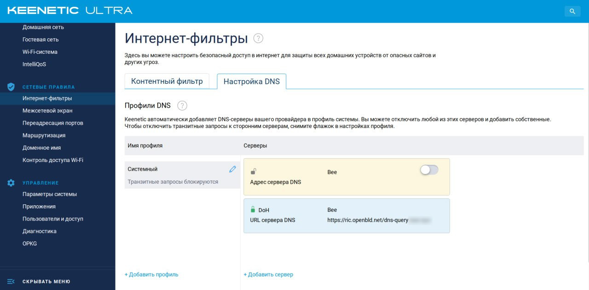
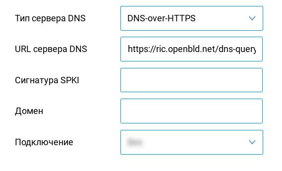
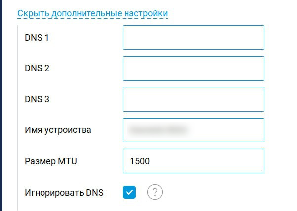

# Сетевые устройства

Если ваш маршрутизатор поддерживает DoH/DoT, вы можете использовать OpenBLD.net как `https` со ссылкой `dns-query`:

```shell
https://ada.openbld.net/dns-query
```

Или, как `tls`:

```shell
ada.openbld.net
```

## Инструкции для устройств

### Keenetic

Используйте ADA или RIC в качестве DoH/DoT DNS-провайдера на вашем маршрутизаторе Keenetic:



При использования DoH:



Не забудьте установить флажок "Игнорировать DNS" в дополнительном окне настроек:



* Как [настроить](https://help.keenetic.com/hc/ru/articles/360007687159-%D0%9F%D1%80%D0%BE%D0%BA%D1%81%D0%B8-%D1%81%D0%B5%D1%80%D0%B2%D0%B5%D1%80%D1%8B-DNS-over-TLS-%D0%B8-DNS-over-HTTPS-%D0%B4%D0%BB%D1%8F-%D1%88%D0%B8%D1%84%D1%80%D0%BE%D0%B2%D0%B0%D0%BD%D0%B8%D1%8F-DNS-%D0%B7%D0%B0%D0%BF%D1%80%D0%BE%D1%81%D0%BE%D0%B2) Keenetic
  * Официальное [руководство](https://support.keenetic.ru/eaeu/ultra/kn-1811/en/31543-dot-and-doh-proxy-servers-for-dns-requests-encryption.html) по настройке DoT и DoH на Keenetic
  * Еще одно [руководство](https://help.keenetic.com/hc/ru/articles/360007687159-%D0%9F%D1%80%D0%BE%D0%BA%D1%81%D0%B8-%D1%81%D0%B5%D1%80%D0%B2%D0%B5%D1%80%D1%8B-DNS-over-TLS-%D0%B8-DNS-over-HTTPS-%D0%B4%D0%BB%D1%8F-%D1%88%D0%B8%D1%84%D1%80%D0%BE%D0%B2%D0%B0%D0%BD%D0%B8%D1%8F-DNS-%D0%B7%D0%B0%D0%BF%D1%80%D0%BE%D1%81%D0%BE%D0%B2) по настройке DoT и DoH на Keenetic

### Mikrotik

:::warning

OpenBLD.net использует протокол **HTTP/2**. Mikrotik не поддерживает HTTP/2 и не может использоваться в качестве клиента DoH.

:::

* Как [настроить](https://jcutrer.com/howto/networking/mikrotik/mikrotik-dns-over-https) Mikrotik
  * В этой статье на шаге 2 указана неработающая ссылка, возможное исправление:
  * `/tool fetch url=https://curl.se/ca/cacert.pem`
  * `/certificate import file-name=cacert.pem passphrase="your password"`
