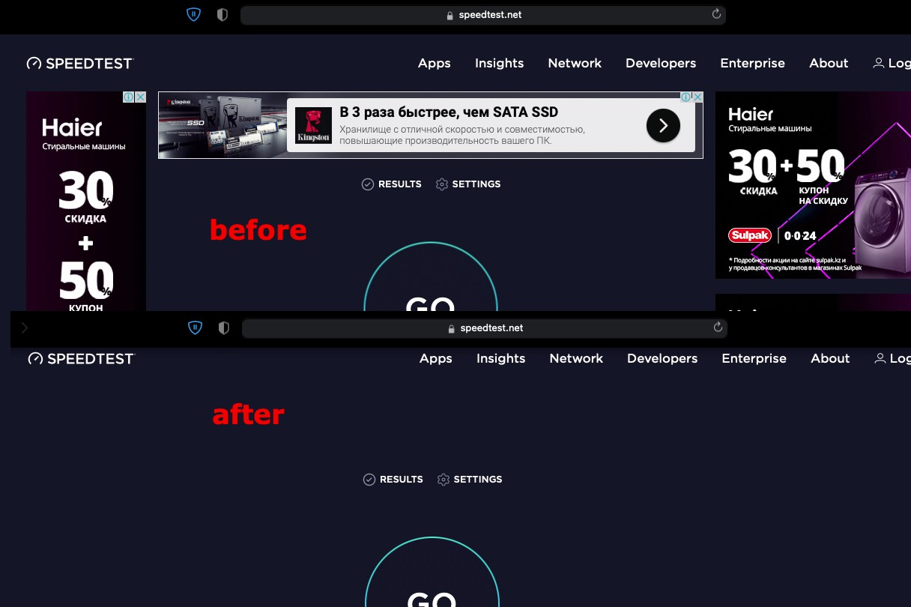

# Как работает сервис

OpenBLD.net DNS — это многофункциональный, простой и быстрый сервис, доступный из разных точек мира. OpenBLD DNS — это открытый DNS-сервис.
- **Легко** - Простое использование без установки программного обеспечения. OpenBLD.net работает в нескольких режимах — Адаптивный (ADA), Строгий (RIC), [OpenBLD+](/docs/overwiew/openbld-plus/).
- **Мультисовместимость** - Достаточно настроить DNS в приватных настройках браузера, мобильного устройства (поддерживаются Android 9+, iOS 14+) или настроить OpenBLD DNS на домашнем или офисном маршрутизаторе и ощутить «эффект OpenBLD» 🌱


# Режимы работы

- **Адаптивный (ADA)** – рекомендуется большинству пользователей.
- **Строгий (RIC)** – рекомендуется для опытных пользователей.
- **OpenBLD+ (BLD+)** — Персональная или корпоративная поддержка. [Подробнее](/docs/overwiew/openbld-plus/).

:::tip
**[OpenBLD Plus](/docs/overwiew/openbld-plus/)** — сюда входит персональная поддержка, отсутствие ограничений на запросы, анализ проблем безопасности или технических инцидентов.
Подробности [здесь](/docs/overwiew/openbld-plus/).
:::

### ADA vs RIC

Ключевое различие между ADA и RIC в OpenBLD.net DNS заключается в том, что ADA позволяет использовать различные сервисы, такие как Яндекс, TikTok, Facebook и т. д. Под «различными сервисами» мы подразумеваем сервисы для управления маркетинговыми кабинетами или бизнес-инструментами.

#### Что разрешает ADA?

- Инструменты социальных сетей (например, Facebook, Twitter, LinkedIn, TikTok и т. д.)
- Все инструменты Яндекса (Алиса, Кинопоиск и т.д.)
- Все инструменты Google
- Рекламные ссылки из результатов поиска
- И т. д.

OpenBLD.net использует детальный подход. Если ADA разрешает, например, все ресурсы Яндекса,
тогда RIC разрешает ключевые сервисы (например: почта, паспорт, деньги и т.д.). Проще говоря, RIC — это более «строгий» сервис, который **_может влиять_** на работу некоторых интернет-сервисов.

ADA — это «надстройка» OpenBLD.net, адаптированная и подходящая для большинства пользователей службы DNS OpenBLD.net.

## Локации

- 🇰🇿 Азия (Казахстан)
- 🇪🇺 Европа (Болгария, Финляндия, Германия, Латвия, Польша, Швейцария, Нидерланды)
- 🇨🇦 Северная Америка (Канада)
- 🇺🇸 США (Силиконовая долина)
- 🇯🇵 Япония (Токио)

:::tip
Серверы могут менять IP-адреса.
Обо всех изменениях сообщается в официальном Telegram-канале проекта см. [Контакты](/docs/contacts) для более подробной информации.
:::

## Подключение

OpenBLD.net поддерживает IPv4 и IPv6 и может использоваться по-разному:

- DoH ADA:
```shell
https://ada.openbld.net/dns-query
```
- DoT ADA:
```shell
ada.openbld.net
```
- DoH RIC:
```shell
https://ric.openbld.net/dns-query
```
- DoT RIC:
```shell
ric.openbld.net
```
- **IPv4** и **IPv6** - если вам действительно нужны IP-адреса, свяжитесь через страницу [Контакты](/docs/contacts).

Более подробную информацию о настройке устройств см. на странице - [Откуда начать](/docs/get-started/where-to-start/).

:::tip
Предпочтительный способ использования DoH или DoT.
IP-адреса могут быть изменены в любой момент, имейте это в виду перед настройкой IP DNS.
:::

##  Правила использования

### Ограничения

OpenBLD.net можно использовать, как обычный DNS-сервис, но с условиями:

- Без особых запросов, таких как AXFR, ANY и т.д.
- Без перебора доменных или поддоменных имен и т. д.
- Не более 100 запросов в секунду с одного IP-адреса.
- Без злоупотребления сервисом.
- Без какой-либо другой вредоносной деятельности.

:::warning
виртуальные серверы из облачных сред будут автоматически заблокированы
:::

В случае нарушений условий использования сервисом - запросы и IP-адреса могут быть **заблокированы**, если это произойдет по ошибке 
или вы заподозрите вредоносную активность, появившуюся в вашей сети, свяжитесь через страницу [Контакты](/docs/contacts)
или попробуйте использовать [OpenBLD Plus](/docs/overwiew/openbld-plus/).

## Исключения

:::tip
OpenBLD не распространяется на YouTube.
:::

## Конфиденциальность

Журналы служб:

- Могут быть включены для устранения неполадок.
- Журналы не собираются и не агрегируются централизованно.
- Могут использоваться для улучшения качества работы сервиса.
- Не передается третьим лицам и сервисам.
- Не собираются в рекламных целях.
- Могут использоваться для оповещений (алертов).
- Не используются для каких-либо других целей.

## Отказ от ответственности

- Этот проект поддерживается персональной деятельностью и ресурсами (такими как время и деньги) [автором](/docs/contacts) проекта. 
- Автор сервиса, команда тестировщиков стремятся сделать Интернет более чистым и без мусора. 
- Сервис поддерживается по мере возможности - автором и пожертвованиями пользователей сервиса.
- У сервиса нет Соглашения об уровне обслуживания (SLA), имейте это в виду при использовании DNS-сервисов OpenBLD.

Полный текст заявления об отказе от ответственности см. [здесь](/docs/disclaimer).

## Технологический стек

OpenBLD.net использует различные технологии, включая проекты с открытым исходным кодом, бесплатные или Freemium - код, пакеты, дистрибутивы, облака и т. д.

Спасибо за открытые инициативы:

[Ansible](https://www.ansible.com/),
[Blocky](https://0xerr0r.github.io/blocky/),
[Bulma](https://bulma.io/),
[Cactusd](https://github.com/m0zgen/cactusd),
[Caddy](https://github.com/caddyserver/caddy)
[CentOS](https://www.centos.org/),
[Debian](https://www.debian.org/),
[Fedora](https://fedoraproject.org/),
[Grafana](https://grafana.com/),
[Knot DNS](https://www.knot-dns.cz/),
[Nginx](https://github.com/nginx),
[Node.js](https://nodejs.org/en),
[Nuxt](https://nuxt.com/),
[PowerDNS](https://www.powerdns.com/),
[Prometheus](https://prometheus.io/),
[React](https://react.dev/),
[Tailwind](https://tailwindcss.com/),
[Vue](https://vuejs.org/),
[zBLD](##хронология-проекта)

Платформы и сервисы:

- [ZeroSSL](https://zerossl.com/), [ClouDNS](https://www.cloudns.net), [Cloudflare](https://www.cloudflare.com/), [GCore](https://gcore.com/), [Unihost.kz](https://unihost.kz/en/), [GoHost.kz](https://gohost.kz/), [UptimeRobot](https://uptimerobot.com/), [Netdata](https://www.netdata.cloud/), [Digital Ocean](https://www.digitalocean.com/), [PowerDMARC](https://powerdmarc.com/), [GitHub](https://github.com)

## Спасибо сообществам

Многие люди обеспокоены Интернетом и его будущим. Спасибо всем сообществам и людям, которые пытаются сделать Интернет лучше, безопаснее и чище!

OpenBLD.net объединяет данные из многих источников, таких как:

[FadeMind](https://github.com/FadeMind/hosts.extras),
[StevenBlack](https://github.com/StevenBlack/hosts),
[notracking](https://github.com/notracking/hosts-blocklists),
[davidonzo](https://github.com/davidonzo/Threat-Intel),
[mitchellkrogza](https://github.com/mitchellkrogza/Badd-Boyz-Hosts),
[oisd](https://oisd.nl/),
[PolishFiltersTeam](https://raw.githubusercontent.com/PolishFiltersTeam/KADhosts/master/KADhosts.txt),
[dns-hole](https://github.com/m0zgen/dns-hole),
[bld-agregator](https://github.com/m0zgen/bld-agregator),
[digitalside](https://osint.digitalside.it/Threat-Intel/lists/latestips.txt),
[firehol level1](https://iplists.firehol.org/files/firehol_level1.netset),
[firehol level2](https://raw.githubusercontent.com/firehol/blocklist-ipsets/master/firehol_level2.netset),
[feodotracker](https://feodotracker.abuse.ch/downloads/ipblocklist_recommended.txt),
[stamparm](https://raw.githubusercontent.com/stamparm/ipsum/master/levels/2.txt), [hagezi dns-blocklists](https://github.com/hagezi/dns-blocklists)

## Хронология проекта

- 2019-2023 - Проект был запущен как персональная инициатива известная под именем Sys-Adm.in BLD (кодовое имя: [aBLD](https://github.com/m0zgen/abld), что подразумевало "Additional Blocky Listener Daemon")
- 2023-Настоящеее время - OpenBLD.net сформировался, как самостоятельный проект, где с нуля бы обновлен весь технологический [стек](##технологический-стек)
и переписана вся кодовая база с учетом использованием новых технологий и пакетов (кодовое имя: _zBLD_, что подразумевает "Zero-Trust BlockList DNS") с возможностями названными [Шестерни](/docs/category/gears/) 
и [OpenBLD Плюс](/docs/overwiew/openbld-plus/).

## Обратная связь

Вы можете отправить отзыв через страницу [Контакты](/docs/contacts).
